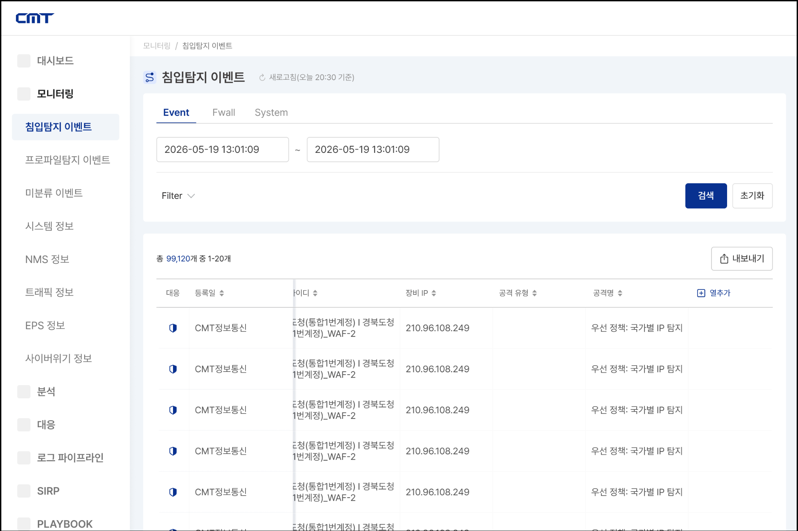
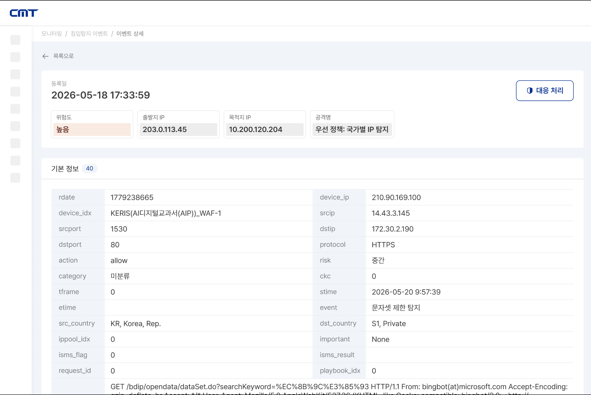
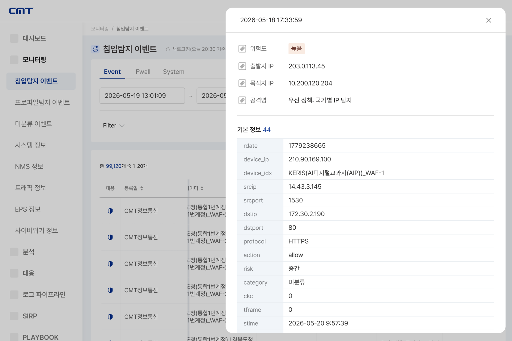
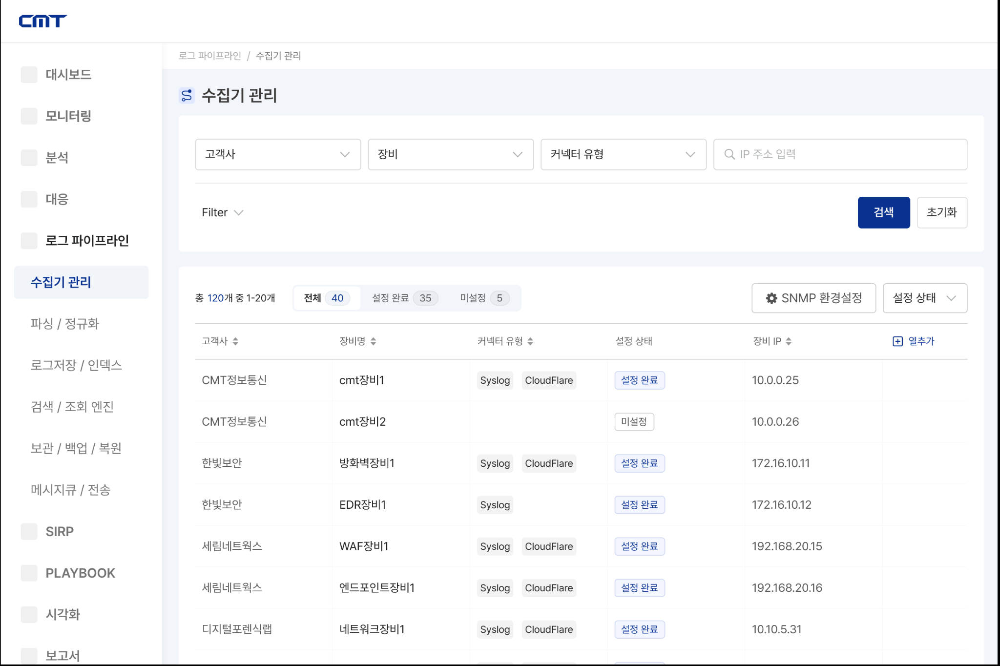
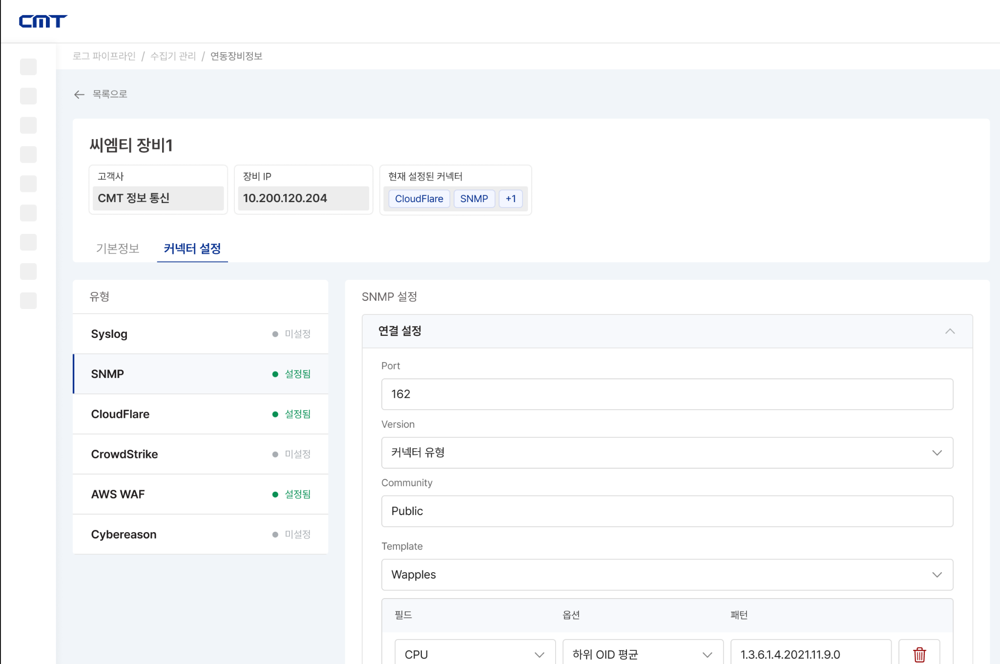
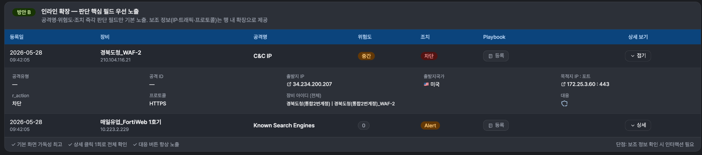

# UX Pain Point 및 문제 정의/가설 정리

## 1. 문서 목적

본 문서는 SIEM 프로젝트의 **침입탐지 이벤트 화면**과 **수집기 관리 화면** 시안에 대한 관계자 피드백을 바탕으로, 리스트 테이블 구조의 문제 정의와 가설, 그리고 현재까지의 설계 방향을 정리하기 위한 문서이다.

특히 침입탐지 이벤트 화면에서는 대량의 이벤트 데이터를 빠르게 스캔해야 하므로, 단순히 많은 컬럼을 나열하는 방식이 아니라 **사용자가 한 행의 이벤트 맥락을 빠르게 판단할 수 있는 리스트 테이블 구조**를 검토한다.

---

## 2. 현재 시안 배경

### 2.1 침입탐지 이벤트 목록 화면

침입탐지 이벤트 화면은 관제 담당자가 이벤트를 조건별로 조회하고, 주요 이벤트를 빠르게 식별하기 위한 화면이다.



### 2.2 침입탐지 이벤트 상세 화면 시안 1: 상세 페이지 전환

row item을 클릭했을 때 별도의 상세 페이지로 이동하여 이벤트 상세 정보를 확인하는 방식이다.



### 2.3 침입탐지 이벤트 상세 화면 시안 2: 모달 팝업

row item을 클릭했을 때 현재 목록 화면의 맥락을 유지한 상태에서 모달로 상세 정보를 확인하는 방식이다.



### 2.4 수집기 관리 목록 화면

수집기 관리 화면은 SIEM으로 로그와 이벤트를 전달하는 수집기 및 커넥터를 등록·설정·관리하기 위한 화면이다.



### 2.5 수집기 관리 상세 / 커넥터 설정 화면

수집기 상세 화면에서는 장비별 커넥터 설정을 관리한다.



---

## 3. 유저의 Pain Point

1. 데이터가 구겨지더라도 스크롤 없이 하나의 리스트 테이블에 모든 정보가 다 보였으면 좋겠다.
2. 마지막 컬럼에 상세 보기 버튼 등이 들어가는 경우, 스크롤을 마지막까지 하지 않으면 해당 버튼을 알아채기 힘들다.

---

## 4. 문제 정의

> 기존 이벤트 목록은 컬럼 커스터마이징과 우측 고정 액션을 제공하지만, 사용자가 한 행의 이벤트 맥락을 기본 화면에서 동시에 확인하기 어렵다.  
> 이로 인해 관계 담당자는 가로 스크롤 또는 컬럼 설정 없이도 주요 이벤트 정보를 한 번에 스캔할 수 있는 테이블 구조를 요구하고 있다.

단순히 “컬럼 수가 많다”가 문제라기보다, 사용자가 이벤트를 판단할 때 필요한 정보가 여러 컬럼으로 분산되고, 일부 정보나 액션이 화면 밖으로 밀려나면서 **이벤트의 전체 맥락과 다음 액션을 한눈에 파악하기 어려운 것**이 핵심 문제로 볼 수 있다.

---

## 5. 가설

### 가설 1

리스트에서 한 행을 판단할 때, 사용자는 스크롤하지 않고도 해당 이벤트의 전체 맥락을 한 번에 확인하고 싶어할 것이다.

### 가설 2

사용자는 일부 데이터가 압축되어 보이더라도, 화면 밖에 정보가 숨겨져 발생할 수 있는 정보 누락 가능성을 더 큰 리스크로 볼 것이다.

### 가설 3

사용자의 핵심 요구 사항은 상세 탐색이 아니라, 목록 단계에서의 빠른 스캔일 것이다.

### 가설 4

사용자가 말한 “모든 정보”는 전체 원천 데이터 전체가 아니라, 이벤트 판단에 필요한 기본 필드 세트일 수 있다.

### 가설 5

사용자별로 중요하게 보는 핵심 정보는 다를 수 있으나, 무제한 열 추가 방식은 다시 가로 스크롤과 정보 밀도 문제를 유발할 수 있다. 따라서 header cell에는 고정된 개수의 핵심 정보 슬롯을 제공하되, 슬롯에 들어갈 정보는 사용자별로 커스터마이징하는 방식이 더 적절할 수 있다.

---

## 6. List Table 시안 비교 결과

### 최종 방향

List table 시안 비교 결과, 테이블은 아래 방향으로 정리한다.



### 결정 사항

- header cell에는 **5가지 주요 데이터**를 고정 노출한다.
- 나머지 상세 정보는 우측의 **상세 버튼**을 통해 row 하단 드롭다운 형태로 노출한다.
- 상세 버튼은 우측에 항상 노출하여, 사용자가 상세 정보 확인 가능성을 놓치지 않도록 한다.
- 기본 목록 상태에서는 사용자가 빠르게 스캔해야 하는 판단 필드만 우선 노출한다.
- 보조 정보는 목록의 시각적 복잡도를 높이지 않도록 드롭다운 영역에 배치한다.

### 방향성 정리

> 기본 목록은 빠른 스캔을 위한 구조로 사용하고,  
> row 단위 상세 드롭다운은 목록 맥락을 유지한 상태에서 추가 정보를 확인하는 구조로 사용한다.

---

## 7. 침입탐지 이벤트 화면 결정 사항

### 7.1 상세 페이지 전환안과 모달안에 대한 피드백

침입탐지 이벤트 상세 화면은 다음 두 가지 안을 검토했다.

1. row item 클릭 시 상세 페이지로 화면 전환
2. row item 클릭 시 modal 형태로 상세 정보 노출

관계자 및 유저 의견이 한쪽으로 명확히 모이지 않았기 때문에, 두 방식 중 하나만 선택하기보다 각 방식의 장점을 함께 살리는 방향으로 정리한다.

### 7.2 최종 인터랙션 방향

- list table의 **상세 버튼**을 클릭하면, 해당 row 하단에 드롭다운 형태로 상세 정보가 노출된다.
- row item 자체를 클릭하면, 별도의 상세 페이지로 화면 전환된다.
- 즉, 목록 안에서 빠르게 확인할 정보와, 깊게 분석해야 할 정보를 분리한다.

### 7.3 역할 분리

| 구분 | 역할 |
|---|---|
| 기본 row | 이벤트를 빠르게 스캔하고 1차 판단하는 영역 |
| 상세 드롭다운 | 목록 맥락을 유지한 상태에서 추가 필드를 확인하는 영역 |
| 상세 페이지 | 원본 로그, 연관 정보, 조치 이력 등 심층 분석을 수행하는 영역 |

### 7.4 Header Cell 커스터마이징 방향

관계자 피드백 중, 사용자가 보는 관점에 따라 핵심 정보가 달라질 수 있으므로 열 추가 기능이 필요하다는 의견이 있었다.

하지만 무제한 열 추가는 최초에 해결하려던 문제인 **가로 스크롤, 정보 압축, 주요 액션 발견성 저하**를 다시 유발할 수 있다.

따라서 다음 방향으로 정리한다.

- header cell에 노출되는 핵심 정보 개수는 **5개로 고정**한다.
- 단, 5개 슬롯에 어떤 정보를 노출할지는 사용자 또는 역할별로 커스터마이징할 수 있도록 한다.
- 커스터마이징은 “컬럼을 계속 추가하는 방식”이 아니라, “고정 슬롯 안에서 정보 항목을 교체하는 방식”으로 제공한다.

예시:

| 고정 슬롯 | 예시 A: 관제 운영자 | 예시 B: 분석가 |
|---|---|---|
| Slot 1 | 등록일 | 등록일 |
| Slot 2 | 장비 | 출발지 IP |
| Slot 3 | 공격명 | 목적지 IP |
| Slot 4 | 위험도 | 공격명 |
| Slot 5 | 조치 | 프로토콜 |

---

## 8. 수집기 관리 화면 결정 사항

### 8.1 피드백

수집기 관리 화면에서는 커넥터 유형이 향후 매우 많아질 수 있으므로, 전체 커넥터를 한 번에 나열하기보다 유형별로 나눠야 한다는 의견이 있었다.

### 8.2 최종 방향

- 커넥터 유형을 구분할 수 있는 선택 UI를 제공한다.
- 사용자가 특정 유형을 선택하면, 해당 유형과 관련된 커넥터만 노출한다.
- 이를 통해 커넥터가 증가하더라도 사용자가 필요한 설정 항목을 빠르게 찾을 수 있도록 한다.

### 8.3 구조 예시

```text
수집기 관리
└ 장비 상세
  └ 커넥터 설정
    ├ 유형: Syslog
    ├ 유형: SNMP
    ├ 유형: CloudFlare
    ├ 유형: CrowdStrike
    ├ 유형: AWS WAF
    └ 유형: Cybereason
```

---

## 9. 핵심 질문

### 9.1 List Table 관련

1. 모든 정보가 같은 중요도를 가지는가?
2. 줄임표가 허용되는 컬럼과 허용되지 않는 컬럼은 무엇인가?
3. 기본 row에서 반드시 보여야 하는 5가지 핵심 정보는 무엇인가?
4. 사용자 또는 역할별로 핵심 정보가 다르다면, 어떤 기준으로 프리셋을 나눌 수 있는가?
5. row 하단 드롭다운에서 제공할 정보와 상세 페이지에서 제공할 정보의 경계는 어디인가?
6. 상세 버튼과 row item 클릭이 동시에 제공될 때, 사용자가 두 액션의 차이를 명확히 이해할 수 있는가?

### 9.2 침입탐지 이벤트 관련

1. 사용자는 목록에서 대부분의 판단을 끝내는가, 아니면 상세 페이지 진입이 잦은가?
2. 상세 드롭다운에서 확인해야 할 최소 정보는 무엇인가?
3. 상세 페이지까지 이동해야 하는 심층 분석 정보는 무엇인가?
4. 대응 버튼은 항상 기본 row에 노출되어야 하는가?
5. Playbook 등록은 기본 row에서 수행해야 하는가, 상세 영역에서 수행해도 되는가?

### 9.3 수집기 관리 관련

1. 커넥터 유형은 어떤 기준으로 분류할 것인가?
2. 하나의 수집기에 여러 커넥터 유형이 연결될 수 있는가?
3. 유형별 커넥터 설정 항목의 구조가 얼마나 다른가?
4. 설정 완료, 미설정, 오류 상태를 목록에서 어느 수준까지 보여줄 것인가?
5. 커넥터 유형이 많아졌을 때 검색과 필터가 함께 필요한가?

---

## 10. 현재 설계 방향 요약

| 영역 | 현재 방향 |
|---|---|
| List Table | header cell 5개 주요 정보 고정, 나머지는 상세 드롭다운 제공 |
| 핵심 정보 설정 | 열 추가가 아니라 5개 슬롯 내 커스터마이징 방식 |
| 침입탐지 이벤트 상세 | 상세 버튼 클릭 시 드롭다운, row 클릭 시 상세 페이지 전환 병행 |
| 상세 페이지 / 모달 | 모달 단독 채택이 아니라 목록 내 드롭다운 + 상세 페이지 구조로 절충 |
| 수집기 관리 | 커넥터 유형별 분류 후, 선택한 유형의 커넥터만 노출 |

---

## 11. 다음 검증 필요 사항

1. header cell에 고정할 5개 정보 슬롯의 기본값을 확정한다.
2. 사용자 또는 역할별 커스터마이징 범위를 정의한다.
3. 상세 드롭다운과 상세 페이지의 정보 범위를 분리한다.
4. row click과 상세 버튼 click의 인터랙션 충돌 가능성을 검토한다.
5. 수집기 관리의 커넥터 유형 분류 기준을 정의한다.
6. 커넥터 유형이 증가했을 때 검색, 필터, 그룹핑이 필요한지 확인한다.
